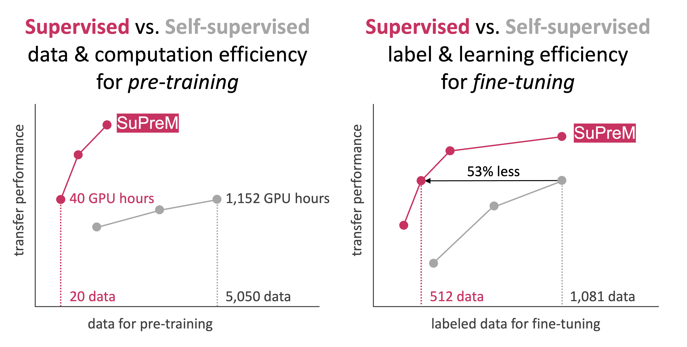

<div align="center">
 
  
**Subscribe us: https://groups.google.com/u/2/g/bodymaps**  
</div>

We developed a suite of pre-trained 3D models, named **SuPreM**, that combined the best of large-scale datasets and per-voxel annotations, showing the transferability across a range of 3D medical imaging tasks.

## Paper

<b>How Well Do Supervised 3D Models Transfer to Medical Imaging Tasks?</b> <br/>
[Wenxuan Li](https://scholar.google.com/citations?hl=en&user=tpNZM2YAAAAJ), [Alan Yuille](https://www.cs.jhu.edu/~ayuille/), and [Zongwei Zhou](https://www.zongweiz.com/)<sup>*</sup> <br/>
Johns Hopkins University  <br/>
International Conference on Learning Representations (ICLR) 2024 (oral; top 1.2%) <br/>
<a href='https://www.zongweiz.com/dataset'></a> <a href='https://www.cs.jhu.edu/~alanlab/Pubs23/li2023suprem.pdf'></a> <a href='document/promotion_slides.pdf'></a> <a href='document/dom_wse_poster.pdf'></a> [](https://vtizr.xetslk.com/s/1HUGNo) <a href='https://www.cs.jhu.edu/news/ai-and-radiologists-unite-to-map-the-abdomen/'></a>

<b>Transitioning to Fully-Supervised Pre-Training with Large-Scale Radiology ImageNet for Improved AI Transferability in Three-Dimensional Medical Segmentation</b> <br/>
[Wenxuan Li](https://scholar.google.com/citations?hl=en&user=tpNZM2YAAAAJ)<sup>1</sup>, [Junfei Xiao](https://lambert-x.github.io/)<sup>1</sup>, [Jie Liu](https://ljwztc.github.io/)<sup>2</sup>, [Yucheng Tang](https://scholar.google.com/citations?hl=en&user=0xheliUAAAAJ)<sup>3</sup>, [Alan Yuille](https://www.cs.jhu.edu/~ayuille/)<sup>1</sup>, and [Zongwei Zhou](https://www.zongweiz.com/)<sup>1,*</sup> <br/>
<sup>1</sup>Johns Hopkins University  <br/>
<sup>2</sup>City University of Hong Kong  <br/>
<sup>3</sup>NVIDIA  <br/>
Radiological Society of North America (RSNA) 2023  <br/>
<a href='document/rsna_abstract.pdf'></a> <a href='document/rsna_slides.pdf'></a>


**&#9733; We have maintained a document for [Frequently Asked Questions](document/frequently_asked_questions.md).**

**&#9733; We have maintained a paper list for [Awesome Medical Pre-Training](document/awesome_medical_pretraining.md).**

**&#9733; We have maintained a paper list for [Awesome Medical Segmentation Backbones](document/awesome_medical_backbone.md).**

## An Extensive Dataset: AbdomenAtlas 1.1

The release of AbdomenAtlas 1.0 can be found at https://huggingface.co/datasets/AbdomenAtlas/AbdomenAtlas1.0Mini

AbdomenAtlas 1.1 is an extensive dataset of 9,262 CT volumes with per-voxel annotation of **25 organs** and pseudo annotations for **seven types of tumors**, enabling us to *finally* perform supervised pre-training of AI models at scale. Based on AbdomenAtlas 1.1, we also provide a suite of pre-trained models comprising several widely recognized AI models. 

<p align="center"></p>

Prelimianry benchmark showed that supervised pre-training strikes as a preferred choice in terms of performance and efficiency compared with self-supervised pre-training. 

We anticipate that the release of large, annotated datasets (AbdomenAtlas 1.1) and the suite of pre-trained models (SuPreM) will bolster collaborative endeavors in establishing Foundation Datasets and Foundation Models for the broader applications of 3D volumetric medical image analysis.

The AbdomenAtlas 1.1 dataset is organized as
```
AbdomenAtlas1.1
    ├── BDMAP_00000001
    │   ├── ct.nii.gz
    │   └── segmentations
    │       ├── aorta.nii.gz
    │       ├── gall_bladder.nii.gz
    │       ├── kidney_left.nii.gz
    │       ├── kidney_right.nii.gz
    │       ├── liver.nii.gz
    │       ├── pancreas.nii.gz
    │       ├── postcava.nii.gz
    │       ├── spleen.nii.gz
    │       ├── stomach.nii.gz
    │       └── ...
    ├── BDMAP_00000002
    │   ├── ct.nii.gz
    │   └── segmentations
    │       ├── aorta.nii.gz
    │       ├── gall_bladder.nii.gz
    │       ├── kidney_left.nii.gz
    │       ├── kidney_right.nii.gz
    │       ├── liver.nii.gz
    │       ├── pancreas.nii.gz
    │       ├── postcava.nii.gz
    │       ├── spleen.nii.gz
    │       ├── stomach.nii.gz
    │       └── ...
    ├── BDMAP_00000003
    │   ├── ct.nii.gz
    │   └── segmentations
    │       ├── aorta.nii.gz
    │       ├── gall_bladder.nii.gz
    │       ├── kidney_left.nii.gz
    │       ├── kidney_right.nii.gz
    │       ├── liver.nii.gz
    │       ├── pancreas.nii.gz
    │       ├── postcava.nii.gz
    │       ├── spleen.nii.gz
    │       ├── stomach.nii.gz
    │       └── ...
    ...
```

## A Suite of Pre-trained Models: SuPreM

The following is a list of supported model backbones in our collection. Select the appropriate family of backbones and click to expand the table, download a specific backbone and its pre-trained weights (`name` and `download`), and save the weights into `./pretrained_weights/`. More backbones will be added along time. **Please suggest the backbone in [this channel](https://github.com/MrGiovanni/SuPreM/issues/1) if you want us to pre-train it on AbdomenAtlas 1.1 containing 9,262 annotated CT volumes.**

<details>
<summary style="margin-left: 25px;">Swin UNETR</summary>
<div style="margin-left: 25px;">

| name | params | pre-trained data | resources | download |
|:----  |:----  |:----  |:----  |:----  |
| [Tang et al.](https://openaccess.thecvf.com/content/CVPR2022/papers/Tang_Self-Supervised_Pre-Training_of_Swin_Transformers_for_3D_Medical_Image_Analysis_CVPR_2022_paper.pdf) | 62.19M | 5050 CT | [](https://github.com/Project-MONAI/research-contributions) | [weights](https://huggingface.co/MrGiovanni/SuPreM/resolve/main/self_supervised_nv_swin_unetr_5050.pt?download=true) |
| [Jose Valanaras et al.](https://arxiv.org/pdf/2307.16896) | 62.19M | 50000 CT/MRI | [](https://github.com/Project-MONAI/research-contributions) | [weights](https://huggingface.co/MrGiovanni/SuPreM/resolve/main/self_supervised_nv_swin_unetr_50000.pth?download=true) |
| [Universal Model](https://openaccess.thecvf.com/content/ICCV2023/papers/Liu_CLIP-Driven_Universal_Model_for_Organ_Segmentation_and_Tumor_Detection_ICCV_2023_paper.pdf) | 62.19M | 2100 CT | [](https://github.com/ljwztc/CLIP-Driven-Universal-Model) | [weights](https://huggingface.co/MrGiovanni/SuPreM/resolve/main/supervised_clip_driven_universal_swin_unetr_2100.pth?download=true) |
| SuPreM | 62.19M | 2100 CT | ours :star2: | [weights](https://huggingface.co/MrGiovanni/SuPreM/resolve/main/supervised_suprem_swinunetr_2100.pth?download=true) |

</div>
</details>

<details>
<summary style="margin-left: 25px;">U-Net</summary>
<div style="margin-left: 25px;">

| name | params | pre-trained data | resources | download |
|:----  |:----  |:----  |:----  |:----  |
| [Models Genesis](http://www.cs.toronto.edu/~liang/Publications/ModelsGenesis/MICCAI_2019_Full.pdf) | 19.08M | 623 CT | [](https://github.com/MrGiovanni/ModelsGenesis) | [weights](https://huggingface.co/MrGiovanni/SuPreM/resolve/main/self_supervised_models_genesis_unet_620.pt?download=true) |
| [UniMiSS](https://link.springer.com/chapter/10.1007/978-3-031-19803-8_33) | tiny | 5022 CT&MRI | [](https://github.com/YtongXie/UniMiSS-code) | [weights](https://huggingface.co/MrGiovanni/SuPreM/resolve/main/self_supervised_unimiss_nnunet_tiny_5022.pth?download=true) |
|  | small | 5022 CT&MRI |  | [weights](https://huggingface.co/MrGiovanni/SuPreM/resolve/main/self_supervised_unimiss_nnunet_small_5022.pth?download=true) |
| [Med3D](https://arxiv.org/pdf/1904.00625.pdf) | 85.75M | 1638 CT | [](https://github.com/Tencent/MedicalNet) | [weights](https://huggingface.co/MrGiovanni/SuPreM/resolve/main/supervised_med3D_residual_unet_1623.pth?download=true) |
| [DoDNet](https://openaccess.thecvf.com/content/CVPR2021/papers/Zhang_DoDNet_Learning_To_Segment_Multi-Organ_and_Tumors_From_Multiple_Partially_CVPR_2021_paper.pdf) | 17.29M | 920 CT | [](https://github.com/jianpengz/DoDNet) | [weights](https://huggingface.co/MrGiovanni/SuPreM/resolve/main/supervised_dodnet_unet_920.pth?download=true) |
| [Universal Model](https://openaccess.thecvf.com/content/ICCV2023/papers/Liu_CLIP-Driven_Universal_Model_for_Organ_Segmentation_and_Tumor_Detection_ICCV_2023_paper.pdf) | 19.08M | 2100 CT | [](https://github.com/ljwztc/CLIP-Driven-Universal-Model) | [weights](https://huggingface.co/MrGiovanni/SuPreM/resolve/main/supervised_clip_driven_universal_unet_2100.pth?download=true) |
| SuPreM | 19.08M | 2100 CT | ours :star2: | [weights](https://huggingface.co/MrGiovanni/SuPreM/resolve/main/supervised_suprem_unet_2100.pth?download=true) |

</div>
</details>

<details>
<summary style="margin-left: 25px;">SegResNet</summary>
<div style="margin-left: 25px;">

| name | params | pre-trained data | resources | download |
|:----  |:----  |:----  |:----  |:----  |
| SuPreM | 4.70M | 2100 CT | ours :star2: | [weights](https://huggingface.co/MrGiovanni/SuPreM/resolve/main/supervised_suprem_segresnet_2100.pth?download=true) |

</div>
</details>

Examples of predicting organ masks on unseen CT volumes using our SuPreM: [README](https://github.com/MrGiovanni/SuPreM/blob/main/direct_inference/README.md)

Examples of fine-tuning our SuPreM on other downstream medical tasks are provided in this repository.

| **task** | **dataset** | **document** |
|:---------|:------------|:-----------|
| organ, muscle, vertebrae, cardiac, rib segmentation | TotalSegmentator | [README](https://github.com/MrGiovanni/SuPreM/blob/main/target_applications/totalsegmentator/README.md) |

#### If you want to re-pre-train SuPreM on AbdomenAtlas 1.1 (*not recommended*), please refer to our [instruction](https://github.com/MrGiovanni/SuPreM/blob/main/supervised_pretraining/README.md)

Estimated cost:
- Eight A100 GPUs
- At least seven days
- 733GB disk space

**&#9733; Or simply make a request here: https://github.com/MrGiovanni/SuPreM/issues/1**


## Citation

```
@inproceedings{li2024well,
  title={How Well Do Supervised Models Transfer to 3D Image Segmentation?},
  author={Li, Wenxuan and Yuille, Alan and Zhou, Zongwei},
  booktitle={The Twelfth International Conference on Learning Representations},
  year={2024}
}

@article{qu2023abdomenatlas,
  title={Abdomenatlas-8k: Annotating 8,000 CT volumes for multi-organ segmentation in three weeks},
  author={Qu, Chongyu and Zhang, Tiezheng and Qiao, Hualin and Tang, Yucheng and Yuille, Alan L and Zhou, Zongwei and others},
  journal={Advances in Neural Information Processing Systems},
  volume={36},
  year={2023}
}
```

## Acknowledgement

This work was supported by the Lustgarten Foundation for Pancreatic Cancer Research and the McGovern Foundation. The codebase is modified from [NVIDIA MONAI](https://monai.io/). Paper content is covered by patents pending.
